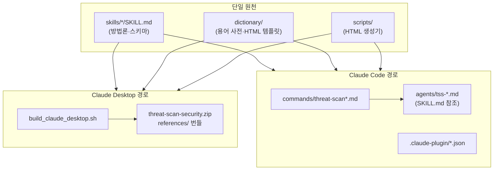
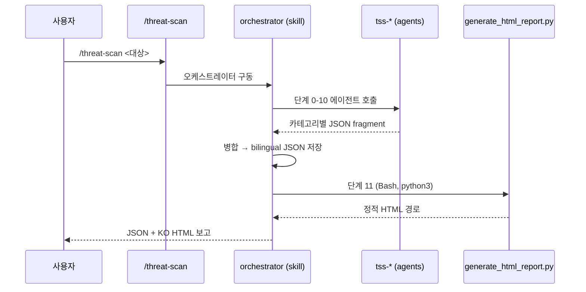

# 아키텍처

**핵심**: 분석 방법론은 `skills/<name>/SKILL.md` **한 곳**에만 있고, Claude Desktop과 Claude Code 두 모드가 이를 공유합니다. 한 번 수정하면 양쪽에 반영됩니다(드리프트 없음).



## 두 모드의 매핑

| 파이프라인 단계 | 단일 원천 (`skills/`) | Code 에이전트 (`agents/`) |
|-----------------|----------------------|---------------------------|
| 오케스트레이션 | threat-scan-orchestrator | (스킬이 직접 구동) |
| 0 소스 준비 | source-handler | tss-source-handler |
| 1 인덱싱 | repo-indexer | tss-repo-indexer |
| 2 정적 코드 | static-code-analyzer | tss-static-analyzer |
| 3 바이너리 | binary-analyzer | tss-binary-analyzer |
| 4 스킬 보안 | skill-security-analyzer | tss-skill-analyzer |
| 4.5 연관관계 | relationship-graph-analyzer | tss-relationship-graph |
| 4.6 모델 유효성 | model-validity-analyzer | tss-model-validity |
| 5 민감 패턴 | sensitive-pattern-matcher | tss-sensitive-patterns |
| 6 정책 | agent-policy-verifier | tss-policy-verifier |
| 7 프롬프트 | prompt-optimizer | tss-prompt-optimizer |
| 8 SBOM | securityreports-sbom | tss-sbom |
| 8.5 심층 트리아지 | securityreports-deepdive | tss-deepdive |
| 9 병합 | report-merger | tss-report-merger |
| 10 번역 | bilingual-translator | tss-translator |
| 11 HTML | html-report-generator | tss-html-report |

> **오케스트레이션은 스킬 레벨에 있습니다.** Claude Code 서브에이전트는 중첩 호출이 불가하므로, `threat-scan-orchestrator` 스킬이 `allowed-tools: Agent(tss-*)`로 워커 에이전트를 구동합니다.

## 실행 흐름 (Claude Code)



## 디렉토리 레이아웃

```text
Threat-scan-security/
├── skills/*/SKILL.md        # 단일 원천 (방법론) — 양 모드 공유
├── agents/tss-*.md          # Claude Code 워커 (SKILL.md 참조)
├── commands/threat-scan*.md # Claude Code 진입점
├── .claude-plugin/          # plugin.json · marketplace.json
├── dictionary/              # 용어 사전 · security-template.html
├── scripts/                 # generate_html_report.py
├── build_claude_desktop.sh  # Desktop zip 빌드
└── docs/                    # 스키마 · 버전별 기획문서
```

## 설계 원칙

- **단일 원천**: 에이전트는 방법론을 복제하지 않고 `${CLAUDE_PLUGIN_ROOT}/skills/<name>/SKILL.md`를 참조.
- **결정론·LLM 경계**: 단계 1–10은 코드 실행·파일 생성 없이 Claude 추론. 단계 0·11만 스크립트 허용.
- **오프라인 호환**: CVE는 모델 지식 + OSV 링크. HTML 차트는 CDN 실패 시 SVG 폴백.
- **스키마 불변**: 출력은 Schema V1.3 고정(`docs/SCHEMA_V1.3_ENFORCEMENT.md`).

## 공유 자산

| 자산 | 역할 |
|------|------|
| `dictionary/security-template.html` | HTML 리포트 템플릿(뷰어 = 생성기 원천) |
| `dictionary/*.json` | 보안 용어 번역 사전 |
| `scripts/generate_html_report.py` | 표준 라이브러리만, `CLAUDE_PLUGIN_ROOT`/repo/dist 경로 자동 해석 |
| `VERSION` | Desktop 빌드·플러그인 버전 동기화 기준 |
