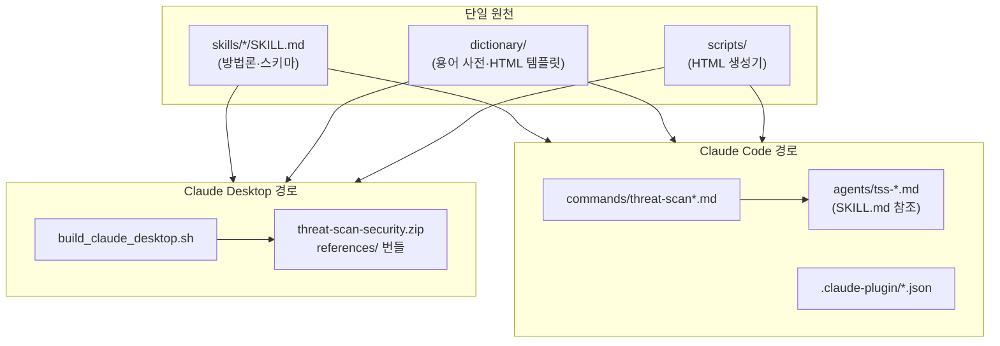
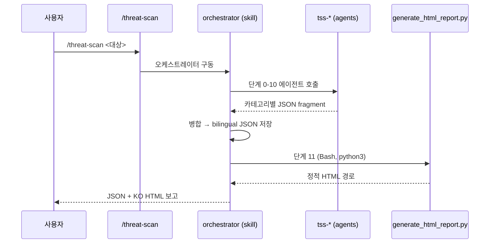

# 아키텍처

**핵심**: 분석 방법론은 `skills/<name>/SKILL.md` **한 곳**에만 있고, Claude Desktop과 Claude Code 두 모드가 이를 공유합니다. 한 번 수정하면 양쪽에 반영됩니다(드리프트 없음).


```mermaid
flowchart TD
  subgraph SRC[단일 원천]
    SK["skills/*/SKILL.md<br/>(방법론·스키마)"]
    DICT["dictionary/<br/>(용어 사전·HTML 템플릿)"]
    SCR["scripts/<br/>(HTML 생성기)"]
  end

  SK --> DESK
  SK --> CODE
  DICT --> DESK
  DICT --> CODE
  SCR --> DESK
  SCR --> CODE

  subgraph DESK[Claude Desktop 경로]
    BUILD["build_claude_desktop.sh"] --> ZIP["threat-scan-security.zip<br/>references/ 번들"]
  end

  subgraph CODE[Claude Code 경로]
    CMD["commands/threat-scan*.md"] --> AG["agents/tss-*.md<br/>(SKILL.md 참조)"]
    PLG[".claude-plugin/*.json"]
  end
```

## 두 모드의 매핑

| 파이프라인 단계 | 단일 원천 (`skills/`) | Code 에이전트 (`agents/`) |
|-----------------|----------------------|---------------------------|
| 오케스트레이션 | threat-scan-orchestrator | (스킬이 직접 구동) |
| 0 소스 준비 | source-handler | tss-source-handler |
| 1 인덱싱 | repo-indexer | tss-repo-indexer |
| 2 정적 코드 | static-code-analyzer | tss-static-analyzer |
| 3 바이너리 | binary-analyzer | tss-binary-analyzer |
| 4 스킬 보안 | skill-security-analyzer | tss-skill-analyzer |
| 4.5 연관관계 | relationship-graph-analyzer | tss-relationship-graph |
| 4.6 모델 유효성 | model-validity-analyzer | tss-model-validity |
| 5 민감 패턴 | sensitive-pattern-matcher | tss-sensitive-patterns |
| 6 정책 | agent-policy-verifier | tss-policy-verifier |
| 7 프롬프트 | prompt-optimizer | tss-prompt-optimizer |
| 8 SBOM | securityreports-sbom | tss-sbom |
| 8.5 심층 트리아지 | securityreports-deepdive | tss-deepdive |
| 9 병합 | report-merger | tss-report-merger |
| 10 번역 | bilingual-translator | tss-translator |
| 11 HTML | html-report-generator | tss-html-report |

> **오케스트레이션은 스킬 레벨에 있습니다.** Claude Code 서브에이전트는 중첩 호출이 불가하므로, `threat-scan-orchestrator` 스킬이 `allowed-tools: Agent(tss-*)`로 워커 에이전트를 구동합니다.

## 실행 흐름 (Claude Code)


```mermaid
sequenceDiagram
  participant U as 사용자
  participant C as /threat-scan
  participant O as orchestrator (skill)
  participant W as tss-* (agents)
  participant P as generate_html_report.py
  U->>C: /threat-scan <대상>
  C->>O: 오케스트레이터 구동
  O->>W: 단계 0-10 에이전트 호출
  W-->>O: 카테고리별 JSON fragment
  O->>O: 병합 → bilingual JSON 저장
  O->>P: 단계 11 (Bash, python3)
  P-->>O: 정적 HTML 경로
  O-->>U: JSON + KO HTML 보고
```

## 디렉토리 레이아웃

```text
Threat-scan-security/
├── skills/*/SKILL.md        # 단일 원천 (방법론) — 양 모드 공유
├── agents/tss-*.md          # Claude Code 워커 (SKILL.md 참조)
├── commands/threat-scan*.md # Claude Code 진입점
├── .claude-plugin/          # plugin.json · marketplace.json
├── dictionary/              # 용어 사전 · security-template.html
├── scripts/                 # generate_html_report.py
├── build_claude_desktop.sh  # Desktop zip 빌드
└── docs/                    # 스키마 · 버전별 기획문서
```

## 디렉토리 용도 분류 (공용 / Desktop / Code / 로컬)

> 분류 기준: **🟢 공용** = 양 모드가 사용하는 단일 원천. **🔵 Code 전용** = Claude Code 플러그인 런타임만 사용.
> **🟠 Desktop 전용** = Desktop zip 빌드·배포에만 관여. **⚪ 로컬 전용** = 개발 머신 세션 설정 — **git 비추적**(.gitignore).

| 경로 | 분류 | 용도 | Desktop 반영 경로 | Code 반영 경로 |
|------|------|------|-------------------|----------------|
| `skills/*/SKILL.md` | 🟢 공용 | 분석 방법론·스키마 단일 원천 | 빌드가 `references/sub-skills/`로 복사 | `tss-*` 에이전트가 Read로 참조 |
| `dictionary/` | 🟢 공용 | 번역 사전(JSON)·HTML 리포트 템플릿 | 빌드가 `references/dictionary/`로 복사 | `generate_html_report.py`가 직접 사용 |
| `scripts/*.py` | 🟢 공용 | 결정론 스크립트 — HTML 생성기·bilingual 조립 | 빌드가 `references/scripts/`로 복사 | 단계 10.5·11에서 직접 실행 |
| `docs/` (스키마 정본) | 🟢 공용 | Schema V1.3 정의·enforcement — 양 모드 방법론이 참조 | 빌드가 `references/docs/`로 일부 복사 | repo 직접 참조 |
| `docs/vX.Y.Z/` | 📄 개발 문서 | 버전별 기획(GOAL·phase)·이슈 패치 문서 | 미포함 | 개발 시 참조 |
| `VERSION` | 🟢 공용 | 버전 동기화 단일 기준 (빌드·plugin.json·help) | 빌드가 읽음 | 범프 시 plugin.json과 동기화 |
| `agents/tss-*.md` | 🔵 Code 전용 | 파이프라인 워커 정의 (방법론은 SKILL.md 참조) | 미포함 (빌드 비복사) | 플러그인 런타임이 로드 |
| `commands/threat-scan*.md` | 🔵 Code 전용 | `/threat-scan` 등 슬래시 커맨드 진입점 | 미포함 | 플러그인 런타임이 로드 |
| `hooks/hooks.json` | 🔵 Code 전용 | SubagentStop 훅(리댁션·완료 로깅) — 런타임 자동 로드 | 미포함 | 플러그인 런타임이 로드 |
| `scripts/*.sh` | 🔵 Code 전용 | 훅 스크립트(redact_secrets·log_completion)·유틸(agent_efficiency) | **의도적 비복사** (Desktop 샌드박스에 셸 없음) | 훅이 실행 |
| `.claude-plugin/` | 🔵 Code 전용 | **배포 매니페스트** — plugin.json(버전)·marketplace.json(마켓 정의). `/plugin marketplace add`가 이 리포지토리에서 읽는 설치 진입점 | 미포함 | 설치·업데이트의 기준 |
| `build_claude_desktop.sh` | 🟠 Desktop 전용 | zip 빌드 도구 — frontmatter 스트립·Code 섹션 제거·references 번들 | 빌드 실행 주체 | 사용 안 함 |
| `dist_claude_desktop/` · `*.zip` | 🟠 Desktop 전용 | 빌드 산출물 — **git 비추적** (태그 시 CI가 생성) | 배포물 그 자체 | 사용 안 함 |
| `.github/workflows/` | 🟠 Desktop 전용 | 태그 push 시 Desktop zip 릴리스 CI | 릴리스 자동화 | 사용 안 함 |
| `CLAUDE.md` | 📄 개발 가이드 | 이 리포지토리를 Claude Code로 **개발**할 때의 규칙 (플러그인 기능 아님 — 추적 유지) | — | — |
| `README` · `INSTALLATION` · `USER_GUIDE` · `ARCHITECTURE` · `CHANGELOG` | 📄 문서 | 사용자·기여자 문서 | 미포함 | — |
| `LICENSE` · `NOTICE` | 📄 라이선스 | Apache-2.0 | 빌드가 패키지 루트로 복사 | repo 포함 |
| `.claude/` | ⚪ 로컬 전용 | 이 머신의 세션 설정(권한 allowlist 등) — **비추적** | — | — |
| `.gemini/` `.cursor/` `.codex/` 등 | ⚪ 로컬 전용 | 타 AI 도구 로컬 가드레일 — **비추적** | — | — |

> **혼동 주의:** `.claude/`(로컬 세션 설정, 비추적)와 `.claude-plugin/`(배포 매니페스트, 추적 필수)은 이름만 비슷할 뿐 정반대 성격이다. `.claude-plugin/`이 없으면 마켓플레이스 설치가 불가능하다.

## 설계 원칙

- **단일 원천**: 에이전트는 방법론을 복제하지 않고 `${CLAUDE_PLUGIN_ROOT}/skills/<name>/SKILL.md`를 참조.
- **결정론·LLM 경계**: 단계 1–10은 코드 실행·파일 생성 없이 Claude 추론. 단계 0·11만 스크립트 허용.
- **오프라인 호환**: CVE는 모델 지식 + OSV 링크. HTML 차트는 CDN 실패 시 SVG 폴백.
- **스키마 불변**: 출력은 Schema V1.3 고정(`docs/SCHEMA_V1.3_ENFORCEMENT.md`).

## 공유 자산

| 자산 | 역할 |
|------|------|
| `dictionary/security-template.html` | HTML 리포트 템플릿(뷰어 = 생성기 원천) |
| `dictionary/*.json` | 보안 용어 번역 사전 |
| `scripts/generate_html_report.py` | 표준 라이브러리만, `CLAUDE_PLUGIN_ROOT`/repo/dist 경로 자동 해석 |
| `VERSION` | Desktop 빌드·플러그인 버전 동기화 기준 |
