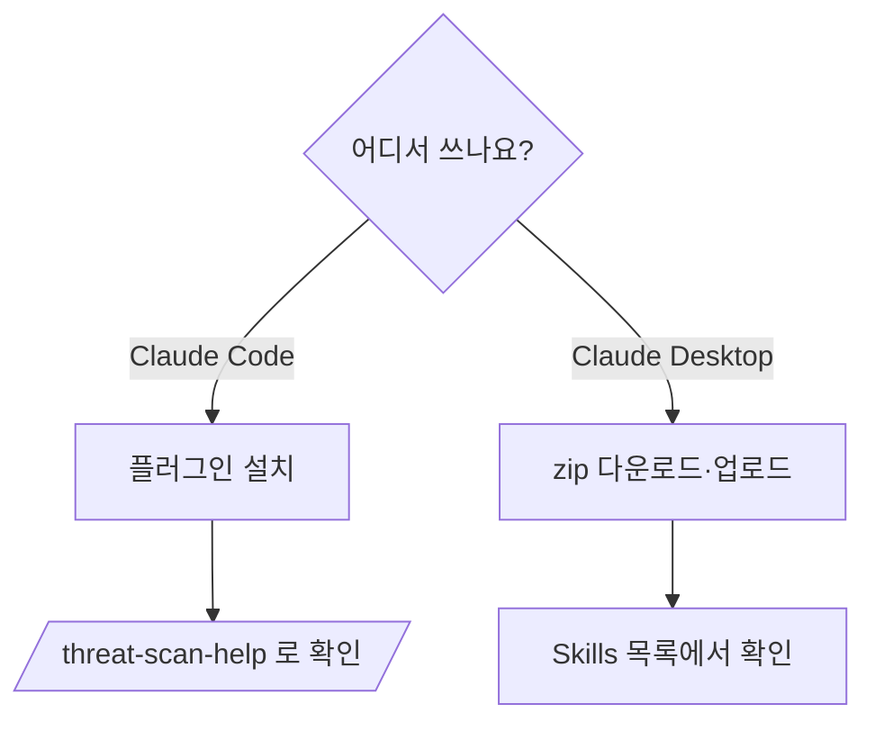

# 설치 가이드

**환경에 맞는 모드 하나를 선택합니다.** 두 모드는 동일한 스캔 기능을 제공합니다.

| 모드 | 대상 | 설치 |
|------|------|------|
| **Claude Code Plugin** | Claude Code (터미널·IDE) | `/plugin marketplace add bosong2/Threat-Scan-Security` |
| **Claude Desktop Skill** | Claude Desktop 앱 | Releases에서 zip 다운로드 → 업로드 |



> **요구사항**: 별도 의존성 없음. 오프라인에서도 동작합니다(CVE는 OSV 조회 링크로 최종 검증).

---

## Claude Code Plugin

```text
/plugin marketplace add bosong2/Threat-Scan-Security
/plugin install threat-scan-security@threat-scan-security-marketplace
```

확인:
```text
/threat-scan-help
```

제거:
```text
/plugin uninstall threat-scan-security@threat-scan-security-marketplace
```

---

## Claude Desktop Skill

1. [Releases](https://github.com/bosong2/Threat-Scan-Security/releases/latest)에서 `threat-scan-security.zip`을 내려받습니다.
2. **Claude Desktop ▸ Settings ▸ Capabilities ▸ Skills ▸ Upload** → 내려받은 zip 선택.
3. Skills 목록에 `threat-scan-security`가 보이면 완료입니다.

---

사용 방법은 [USER_GUIDE.md](USER_GUIDE.md)를 참고하세요.
