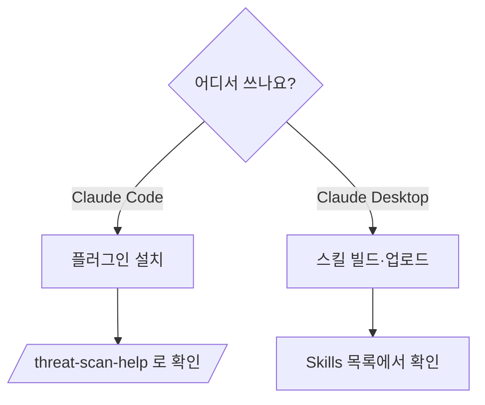

# 설치 가이드

**두 가지 모드 중 환경에 맞는 하나를 선택합니다.** 둘은 동일한 스캔 로직을 공유합니다.

| 모드 | 대상 | 한 줄 설치 |
|------|------|-----------|
| **Claude Code Plugin** | 터미널·IDE에서 Claude Code 사용 | `/plugin marketplace add <path>` |
| **Claude Desktop Skill** | Claude Desktop 앱 | `build_claude_desktop.sh` → zip 업로드 |



## 요구사항

- **공통**: HTML 리포트 생성에 Python 3 (macOS·Linux 기본 탑재).
- **Claude Code**: 플러그인/마켓플레이스 지원 버전.
- **Claude Desktop**: Skills 업로드 지원 버전.
- **네트워크**: 불필요. CVE 점검은 모델 학습 지식 + OSV 조회 링크로 동작(오프라인 호환).

---

## Claude Code Plugin

이 리포지토리 자체가 마켓플레이스입니다(`.claude-plugin/marketplace.json`).

```text
/plugin marketplace add /path/to/Threat-scan-security
/plugin install threat-scan-security@threat-scan-security-marketplace
```

확인:
```text
/plugin              # threat-scan-security 가 enabled
/threat-scan-help    # 커맨드·파이프라인 안내 출력
```

제거:
```text
/plugin uninstall threat-scan-security@threat-scan-security-marketplace
```

> 모든 컴포넌트는 `threat-scan*` / `tss-*` 로 네임스페이스되어 기존 스킬·에이전트와 충돌하지 않습니다.

---

## Claude Desktop Skill

```bash
bash build_claude_desktop.sh
# → threat-scan-security.zip 생성 (references/ 에 스킬·사전·스크립트 번들)
```

업로드: **Claude Desktop ▸ Settings ▸ Capabilities ▸ Skills ▸ Upload** → `threat-scan-security.zip` 선택.

확인: Skills 목록에 `threat-scan-security` 표시 → 대화창에서 오케스트레이터 호출:
```text
@threat-scan-orchestrator <대상 경로> 전체 보안 스캔 수행
```

---

## 검증

| 모드 | 검증 |
|------|------|
| Code | `/threat-scan-help` 출력, `/agents` 에 `tss-*` 15개 표시 |
| Desktop | zip 업로드 후 Skills 활성, 샘플 경로 스캔 시 JSON + HTML 산출 |

문제 시 [USER_GUIDE.md](USER_GUIDE.md)·[ARCHITECTURE.md](ARCHITECTURE.md) 참고.
