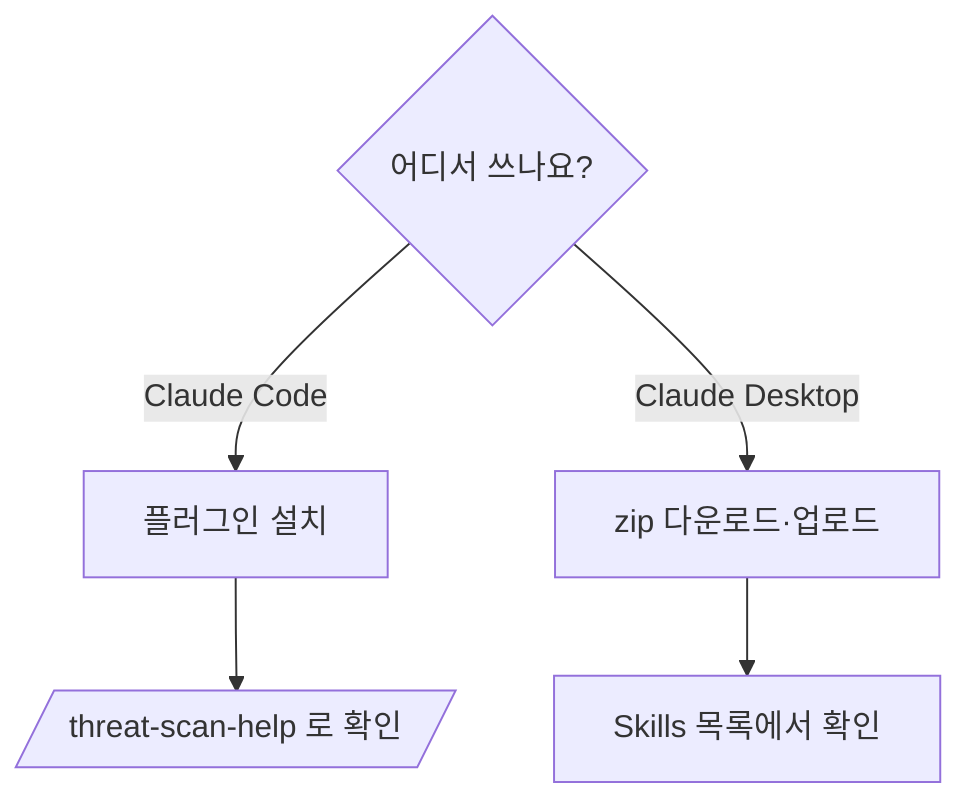

# 설치 가이드

**환경에 맞는 모드 하나를 선택합니다.** 두 모드는 동일한 스캔 기능을 제공합니다.

| 모드 | 대상 | 설치 |
|------|------|------|
| **Claude Code Plugin** | Claude Code (터미널·IDE) | `/plugin marketplace add bosong2/Threat-Scan-Security` |
| **Claude Desktop Skill** | Claude Desktop 앱 | Releases에서 zip 다운로드 → 업로드 |



> **요구사항**: 별도 의존성 없음. 오프라인에서도 동작합니다(CVE는 OSV 조회 링크로 최종 검증).

---

## Claude Code Plugin

```text
/plugin marketplace add bosong2/Threat-Scan-Security
/plugin install threat-scan-security@threat-scan-security-marketplace
```

확인:
```text
/threat-scan-help
```

### 권한 설정 (권장 — 무중단 스캔)

스캔 파이프라인의 분석 에이전트들은 임시 작업 디렉터리(`tss.*`)에 중간 결과 JSON을 기록합니다.
Claude Code 기본 권한 모드에서는 서브에이전트의 파일 쓰기에 승인 프롬프트가 뜰 수 있습니다.
프롬프트 없이 매끄럽게 스캔하려면 사용자/프로젝트 `settings.json`의 `permissions.allow`에
아래 규칙을 추가하세요(macOS·Linux 임시 경로 모두 포함):

```json
{
  "permissions": {
    "allow": [
      "Write(/tmp/tss.*/**)",
      "Write(/var/folders/**/tss.*/**)",
      "Write(/private/var/folders/**/tss.*/**)",
      "Write(*/scanreport-*.json)",
      "Write(*/scanreport-*.html)"
    ]
  }
}
```

> 규칙을 추가하지 않아도 스캔은 동작합니다(첫 쓰기에서 승인하면 됨). 다만 오케스트레이터는
> 8개 병렬 분석 **이전에** `tss-repo-indexer`로 쓰기 권한을 사전 점검(probe)하므로, 권한이
> 막혀 있으면 배치를 띄우기 전에 위 규칙 추가를 안내하고 중단합니다.

제거:
```text
/plugin uninstall threat-scan-security@threat-scan-security-marketplace
```

---

## Claude Desktop Skill

1. [Releases](https://github.com/bosong2/Threat-Scan-Security/releases/latest)에서 `threat-scan-security.zip`을 내려받습니다.
2. **Claude Desktop ▸ Settings ▸ Capabilities ▸ Skills ▸ Upload** → 내려받은 zip 선택.
3. Skills 목록에 `threat-scan-security`가 보이면 완료입니다.

---

사용 방법은 [USER_GUIDE.md](USER_GUIDE.md)를 참고하세요.
