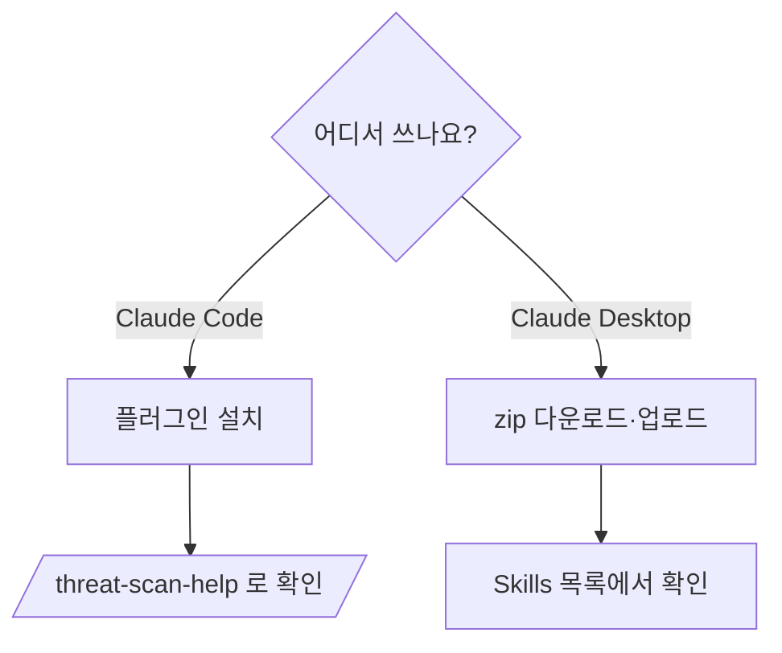

# 설치 가이드

**환경에 맞는 모드 하나를 선택합니다.** 두 모드는 동일한 스캔 기능을 제공합니다.

| 모드 | 대상 | 설치 |
|------|------|------|
| **Claude Code Plugin** | Claude Code (터미널·IDE) | `/plugin marketplace add bosong2/Threat-Scan-Security` |
| **Claude Desktop Skill** | Claude Desktop 앱 | Releases에서 zip 다운로드 → 업로드 |


```mermaid
flowchart TD
  Q{어디서 쓰나요?} -->|Claude Code| CC[플러그인 설치]
  Q -->|Claude Desktop| CD[zip 다운로드·업로드]
  CC --> CCV[/threat-scan-help 로 확인/]
  CD --> CDV[Skills 목록에서 확인]
```

> **요구사항**: 별도 의존성 없음. 오프라인에서도 동작합니다(CVE는 OSV 조회 링크로 최종 검증).

---

## Claude Code Plugin

```text
/plugin marketplace add bosong2/Threat-Scan-Security
/plugin install threat-scan-security@threat-scan-security-marketplace
```

확인:
```text
/threat-scan-help
```

### 권한 설정 (무중단 스캔)

스캔 파이프라인은 임시 작업 디렉터리(`tss.*`)에 중간 결과 JSON을 기록하므로 Claude Code 기본
권한 모드에서는 쓰기 승인 프롬프트가 뜰 수 있습니다. 아래 3가지 방법 중 하나로 무중단 스캔을 보장합니다.

**1순위 — 자동 (권장, 별도 조치 불필요):** `/threat-scan`을 처음 실행하면 오케스트레이터가 권한
규칙 부재를 감지해 프로젝트 `.claude/settings.local.json`에 규칙을 등록합니다. 이때 **승인 1회**만
누르면 이후 전 과정이 무정지로 완주합니다.

**2순위 — 사전 등록:** 스캔 전에 미리 등록하고 싶으면 `/threat-scan-setup`을 1회 실행합니다.

**3순위 — 수동:** 직접 `settings.json`의 `permissions.allow`에 추가(macOS·Linux 임시 경로 포함):

```json
{
  "permissions": {
    "allow": [
      "Write(/tmp/tss.*/**)",
      "Write(/var/folders/**/tss.*/**)",
      "Write(/private/var/folders/**/tss.*/**)",
      "Write(*/scanreport-*.json)",
      "Write(*/scanreport-*.html)"
    ]
  }
}
```

> 오케스트레이터는 8개 병렬 분석 **이전에** `tss-repo-indexer`로 쓰기 권한을 사전 점검(probe)하므로,
> 권한이 여전히 막혀 있으면 배치를 띄우기 전에 안내하고 중단합니다(통째 hang 예방).

제거:
```text
/plugin uninstall threat-scan-security@threat-scan-security-marketplace
```

---

## Claude Desktop Skill

1. [Releases](https://github.com/bosong2/Threat-Scan-Security/releases/latest)에서 `threat-scan-security.zip`을 내려받습니다.
2. **Claude Desktop ▸ Settings ▸ Capabilities ▸ Skills ▸ Upload** → 내려받은 zip 선택.
3. Skills 목록에 `threat-scan-security`가 보이면 완료입니다.

---

사용 방법은 [USER_GUIDE.md](USER_GUIDE.md)를 참고하세요.
