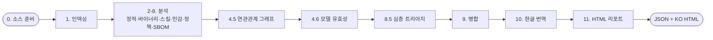

# Threat-scan-security

> AI 에이전트 생태계 아티팩트(Skill·Agent·Plugin·Repo)를 **보안·모델 유효성·연관관계** 관점에서 점검하고, **이중 언어 JSON + 정적 HTML 리포트**를 산출하는 LLM 기반 보안 스캐너.

**하나의 리포지토리, 두 가지 실행 모드** — Claude Desktop 스킬과 Claude Code 플러그인을 동시에 지원합니다.

| 모드 | 진입점 | 설치 |
|------|--------|------|
| **Claude Desktop Skill** | 오케스트레이터 스킬 업로드 | `build_claude_desktop.sh` → zip 업로드 |
| **Claude Code Plugin** | `/threat-scan <target>` | `/plugin marketplace add bosong2/Threat-Scan-Security` |

---

## 핵심 기능

- **단계별 보안 스캔** — 정적 코드·바이너리·스킬 정의·민감 패턴·에이전트 정책·SBOM 의존성.
- **컴플라이언스 태깅 (v2.5.0)** — 각 finding에 KISA(49)·AILLM(9)·TA(10) 컴플라이언스 제어 태그를 부여(Schema V1.4 `compliance_tags`). HTML 리포트에 네임스페이스별 배지로 표시.
- **연관관계 그래프 + 위험 전파** — 컴포넌트 신뢰 엣지를 따라 위험을 전파해 그래프 단위 verdict 산출.
- **모델 유효성 판정** — 특정 모델 고정(MODEL_LOCKED)·네이티브 기능 진부화(OBSOLETE) 탐지.
- **심층 트리아지** — Medium↑ finding을 최대 3단계 재귀 분석, 오탐 분류 + 코드 수정안 + 태그 검증(CTID-V).
- **광범위 SBOM 인식** — 17개 생태계의 매니페스트 + lock 파일, 전이 의존성까지 점검.
- **정적 HTML 리포트** — 결정론적 스크립트로 JSON → 자기완결 HTML(EN/KO 토글·도넛 차트·다크 코드뷰·컴플라이언스 배지·프린트).
- **자율 완주 + 무정지 실행** — 시작 후 사용자 개입 없이 완주(권한 자동 셋업 승인 1회, AI 구성요소 발견 시 범위 질문 1회 제외).

## 빠른 시작

**Claude Code**
```text
/plugin marketplace add bosong2/Threat-Scan-Security
/plugin install threat-scan-security@threat-scan-security-marketplace
/threat-scan https://github.com/owner/repo
```

> 권한 규칙이 없으면 첫 스캔 시 오케스트레이터가 1회 승인을 요청해 자동 등록합니다
> (사전 등록: `/threat-scan-setup`). 승인 후 무정지로 완주합니다.

**Claude Desktop**
```bash
bash build_claude_desktop.sh          # → threat-scan-security.zip
# Claude Desktop ▸ Settings ▸ Capabilities ▸ Skills ▸ Upload
```

자세한 설치는 [INSTALLATION.md](INSTALLATION.md), 사용법은 [USER_GUIDE.md](USER_GUIDE.md) 참고.

## 파이프라인



## 산출물

- `scanreport-YYYYMMDDhhmmss.json` — Schema V1.4 이중 언어(영문+한글) 리포트. finding에 `compliance_tags`(optional), enum 값은 EN/KO 동일(영문 원문).
- `scanreport-YYYYMMDDhhmmss.html` — 정적 HTML 리포트(기본 KO, EN 토글·컴플라이언스 배지·다크 코드뷰·프린트 지원).

## Verdict 체계

| Verdict | 의미 | | Model Effectiveness | 의미 |
|---------|------|---|---------------------|------|
| `INSTALL_OK` | 안전 | | `VALID` | 유효 |
| `REVIEW` | 검토 필요 | | `DEGRADED` | 성능 저하 |
| `DISABLE` | 사용 중지 | | `OBSOLETE` | 네이티브로 진부화 |
| `REMOVE` | 즉시 제거 | | `MODEL_LOCKED` | 폐기 모델 고정 |

## 컴플라이언스 태그 (Schema V1.4)

| 네임스페이스 | 프레임워크 | 예 |
|--------------|-----------|-----|
| `KISA` | KISA 소프트웨어 보안약점 진단가이드(2021, 49종) | `#KISA-1_1`(SQL 삽입) |
| `AILLM` | OWASP LLM Top 10 2025 / CWE / MITRE ATLAS(9종) | `#AILLM-8_7`(과도한 에이전트 권한) |
| `TA` | Technical/Administrative 체크리스트(정적 평가 부분집합, 10종) | `#TA-T_I3`(공개 버킷) |

태그는 근본원인 기준으로 finding에 부여되며(0–4개, primary 우선), EN/KO 리포트에 동일하게 유지됩니다.
검증: `python3 scripts/validate_compliance_tags.py <report.json>`.

## 문서

| 문서 | 내용 |
|------|------|
| [INSTALLATION.md](INSTALLATION.md) | 두 모드 설치·검증·제거 |
| [USER_GUIDE.md](USER_GUIDE.md) | 사용법·입출력·리포트 보기 |
| [ARCHITECTURE.md](ARCHITECTURE.md) | dual-mode 구조·단일 원천·컴포넌트 매핑 |
| [CHANGELOG.md](CHANGELOG.md) | 버전 이력 |

## 라이선스 · 저작자

- **License**: [Apache License 2.0](LICENSE) — 고지는 [NOTICE](NOTICE) 참고.
- **Author**: Bosung Hong ([bosong2](https://github.com/bosong2))
- **Repository**: https://github.com/bosong2/Threat-Scan-Security
