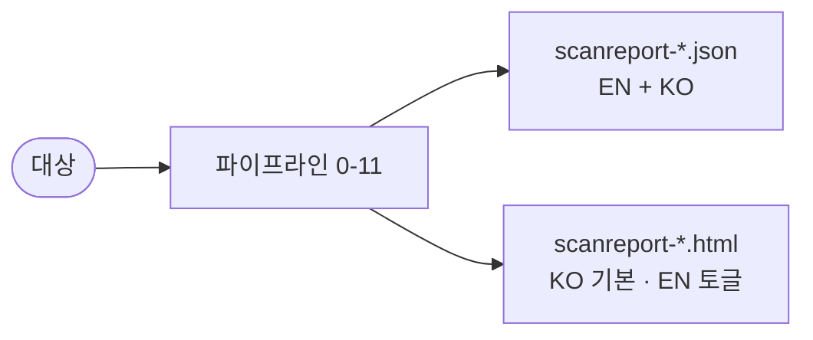

# 사용 가이드

**한 줄 요약**: 대상을 지정하면 전체 보안 스캔 후 **JSON + 한글 HTML 리포트**가 나옵니다.

```text
Claude Code:    /threat-scan <대상>
Claude Desktop: @threat-scan-orchestrator <대상> 전체 보안 스캔 수행
```

## 입력 유형

| 유형 | 예시 |
|------|------|
| 로컬 경로 | `/Users/me/project` |
| GitHub URL | `https://github.com/owner/repo` |
| GitHub 단축 | `owner/repo` |
| ZIP 파일 | `/path/to/project.zip` |

## 커맨드 (Claude Code)

| 커맨드 | 설명 |
|--------|------|
| `/threat-scan <대상>` | 전체 스캔 → JSON + KO HTML |
| `/threat-scan-html <json> [ko\|en]` | 기존 JSON으로 HTML만 재생성 |
| `/threat-scan-help` | 커맨드·파이프라인·verdict 안내 |

기본 동작은 **별도 요구가 없으면 JSON과 KO HTML을 함께 산출**합니다.

## 출력물



- **JSON** — Schema V1.3, `english_report` + `korean_report` 이중 언어.
- **HTML** — 자기완결 정적 파일. 헤더에 EN/KO 토글·프린트 버튼, 위험 분포 도넛 차트, 종합 위험도, 권장조치.

## 결과 읽기

| 구분 | 값 | 의미 |
|------|-----|------|
| **Verdict** | `INSTALL_OK` / `REVIEW` / `DISABLE` / `REMOVE` | 컴포넌트 설치 판정 |
| **Severity** | `Critical` / `High` / `Medium` / `Low` | finding 심각도 |
| **Status** | `Confirmed` / `Mitigated` / `False Positive` | 트리아지 결과 |
| **Model** | `VALID` / `DEGRADED` / `OBSOLETE` / `MODEL_LOCKED` | 모델 유효성 |

## HTML 리포트 보기

- 브라우저로 `.html` 열기 → 기본 한글. 헤더 **EN/KO** 토글로 언어 전환, **프린트**로 PDF 저장.
- 오프라인이면 도넛 차트가 내장 SVG로 자동 대체됩니다.

## SBOM 점검 팁 (전이 의존성)

의존성 취약점을 빠짐없이 보려면 **lock 파일을 함께 두고 스캔**하세요. 전이(transitive) 의존성은 lock 파일에만 명시됩니다.

```bash
pip freeze > requirements-lock.txt    # Python
npm install                            # → package-lock.json
poetry lock                            # → poetry.lock
```

lock 파일이 없으면 직접 의존성만 점검되고, 리포트 `scan_notes`에 경고가 남습니다. 17개 생태계(npm·PyPI·Maven·Go·Cargo·NuGet·Composer·Pub·Hex 등)의 매니페스트·lock 파일을 인식합니다.

## 제약

- 단계 1–10은 **코드 실행·파일 생성 없이** Claude 추론으로 수행(Desktop 샌드박스 호환).
- 단계 0(소스 준비)·단계 11(HTML 생성)만 스크립트 실행.
- CVE 점검은 모델 학습 지식 기반이며, 각 항목에 OSV 조회 링크를 제공해 최종 검증을 돕습니다.
