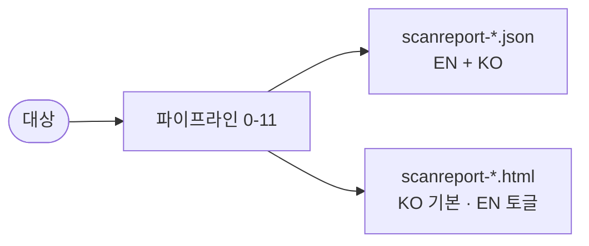

# 사용 가이드

**한 줄 요약**: 대상을 지정하면 전체 보안 스캔 후 **JSON + 한글 HTML 리포트**가 나옵니다.

```text
Claude Code:    /threat-scan <대상>
Claude Desktop: @threat-scan-orchestrator <대상> 전체 보안 스캔 수행
```

## 입력 유형

| 유형 | 예시 |
|------|------|
| 로컬 경로 | `/Users/me/project` |
| GitHub URL | `https://github.com/owner/repo` |
| GitHub 단축 | `owner/repo` |
| ZIP 파일 | `/path/to/project.zip` |

## 커맨드 (Claude Code)

| 커맨드 | 설명 |
|--------|------|
| `/threat-scan <대상>` | 전체 스캔 → JSON + KO HTML |
| `/threat-scan-setup` | 권한 사전등록 (선택 — 첫 스캔 시 자동 수행) |
| `/threat-scan-html <json> [ko\|en]` | 기존 JSON으로 HTML만 재생성 |
| `/threat-scan-help` | 커맨드·파이프라인·verdict 안내 |

기본 동작은 **별도 요구가 없으면 JSON과 KO HTML을 함께 산출**합니다.

### 무정지 실행 (v2.5.0)

스캔은 시작 후 사용자 개입 없이 완주합니다. 예외는 정확히 2가지입니다:

1. **권한 자동 셋업** — 처음 실행하는 프로젝트에서 권한 규칙이 없으면 오케스트레이터가
   `.claude/settings.local.json`에 규칙을 등록하며 **승인 1회**를 요청합니다(사전 등록: `/threat-scan-setup`).
2. **AI 구성요소 스캔 범위** — 대상에 `.claude/`·`.cursor/`·`AGENTS.md` 등 AI 도구 구성요소가
   발견되면 스캔 포함 여부를 **1회** 묻습니다(포함 권장 / 제외). 없으면 질문 없이 진행합니다.

## 출력물


```mermaid
flowchart LR
  IN([대상]) --> SCAN[파이프라인 0-11]
  SCAN --> J[scanreport-*.json<br/>EN + KO]
  SCAN --> H[scanreport-*.html<br/>KO 기본 · EN 토글]
```

- **JSON** — Schema V1.4, `english_report` + `korean_report` 이중 언어. finding에 `compliance_tags`(optional).
- **HTML** — 자기완결 정적 파일. 헤더에 EN/KO 토글·프린트 버튼, 위험 분포 도넛 차트, 종합 위험도,
  **권장조치(리포지토리 요약 바로 다음)**, 컴플라이언스 배지, 다크 코드뷰(`code_fix` 구문 강조).

## 결과 읽기

| 구분 | 값 | 의미 |
|------|-----|------|
| **Verdict** | `INSTALL_OK` / `REVIEW` / `DISABLE` / `REMOVE` | 컴포넌트 설치 판정 |
| **Severity** | `Critical` / `High` / `Medium` / `Low` | finding 심각도 |
| **Status** | `Confirmed` / `Mitigated` / `False Positive` | 트리아지 결과 |
| **Model** | `VALID` / `DEGRADED` / `OBSOLETE` / `MODEL_LOCKED` | 모델 유효성 |
| **Compliance** | `#KISA-*` / `#AILLM-*` / `#TA-*` | 위반 컴플라이언스 제어(태그 배지, 마우스오버로 제어명) |

> **표기 규칙(v2.5.0):** 위 enum 값(Verdict·Severity·Status·Model·priority 등)은 리포트 언어와
> 무관하게 **영어 원문**으로 표기됩니다(한글 리포트에서도 `Critical`, `REMOVE`). 서술 문장만 번역됩니다.

## 컴플라이언스 태그

각 finding에는 근본원인에 해당하는 컴플라이언스 제어 태그가 최대 4개(primary 우선) 붙습니다.

| 네임스페이스 | 프레임워크 |
|--------------|-----------|
| `KISA` | KISA 소프트웨어 보안약점 진단가이드 2021 (49종) |
| `AILLM` | OWASP LLM Top 10 2025 · CWE · MITRE ATLAS (9종) |
| `TA` | Technical/Administrative 체크리스트 정적 부분집합 (10종) |

HTML 리포트에서 배지에 마우스를 올리면 제어명이 표시됩니다. 태그 정합성은
`python3 scripts/generate_html_report.py <report>.json --coverage`로 KISA 카테고리 커버리지를 확인하거나,
`python3 scripts/validate_compliance_tags.py <report>.json`으로 검증할 수 있습니다.

## HTML 리포트 보기

- 브라우저로 `.html` 열기 → 기본 한글. 헤더 **EN/KO** 토글로 언어 전환, **프린트**로 PDF 저장.
- 오프라인이면 도넛 차트가 내장 SVG로 자동 대체됩니다.

## SBOM 점검 팁 (전이 의존성)

의존성 취약점을 빠짐없이 보려면 **lock 파일을 함께 두고 스캔**하세요. 전이(transitive) 의존성은 lock 파일에만 명시됩니다.

```bash
pip freeze > requirements-lock.txt    # Python
npm install                            # → package-lock.json
poetry lock                            # → poetry.lock
```

lock 파일이 없으면 직접 의존성만 점검되고, 리포트 `scan_notes`에 경고가 남습니다. 17개 생태계(npm·PyPI·Maven·Go·Cargo·NuGet·Composer·Pub·Hex 등)의 매니페스트·lock 파일을 인식합니다.

## 제약

- 단계 1–10은 **코드 실행·파일 생성 없이** Claude 추론으로 수행(Desktop 샌드박스 호환).
  분석 워커는 읽기 전용 탐색 도구(`Glob`/`Grep`)로 전체 트리를 완전 열거합니다(코드 실행 아님).
- 셸 실행 허용 예외: 단계 0(소스 준비)·단계 10.5(분할 모드 조립 `assemble_bilingual.py`)·
  단계 11(HTML 생성 + `validate_compliance_tags.py` 검증) — 모두 결정론 스크립트로 LLM 추론 없음.
- CVE 점검은 모델 학습 지식 기반이며, 각 항목에 OSV 조회 링크를 제공해 최종 검증을 돕습니다.
